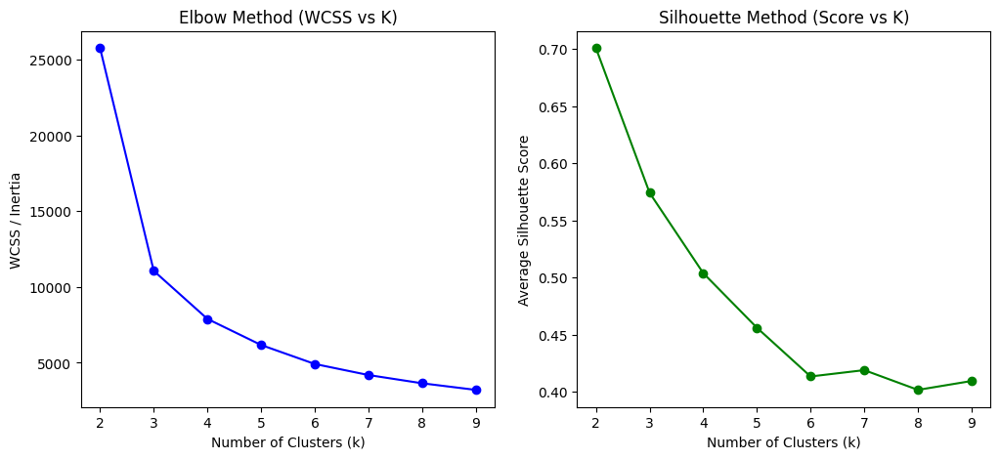
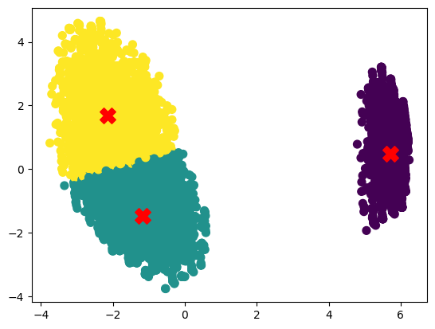
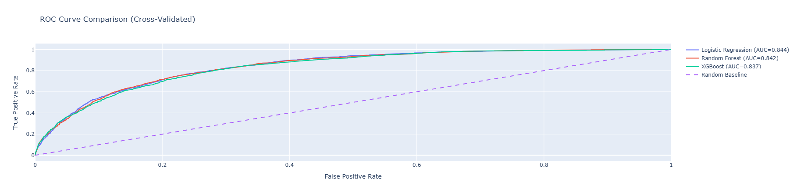
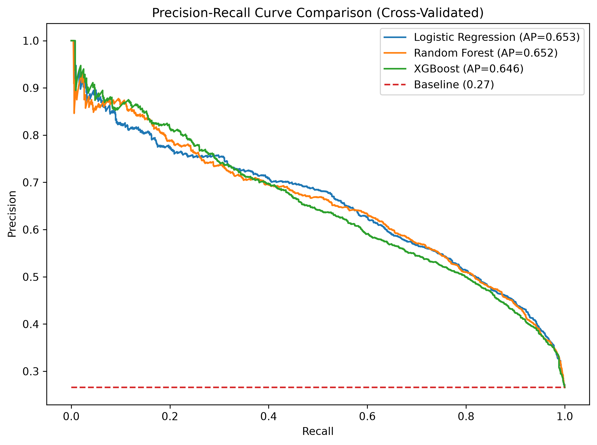
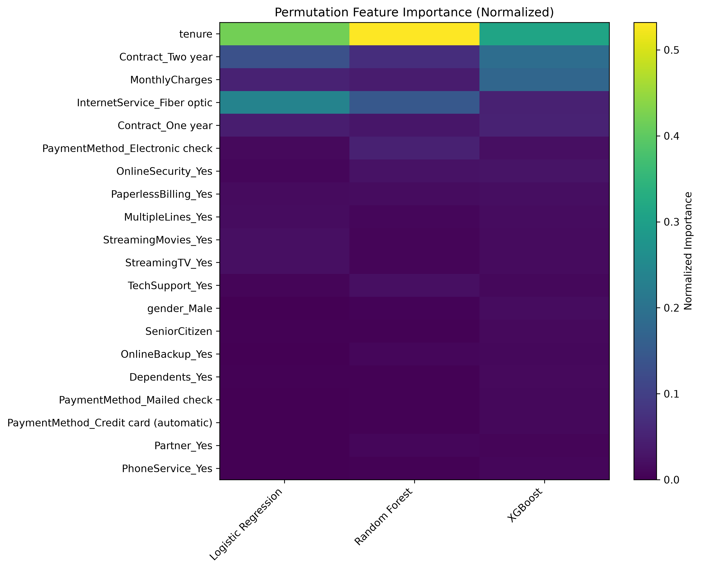
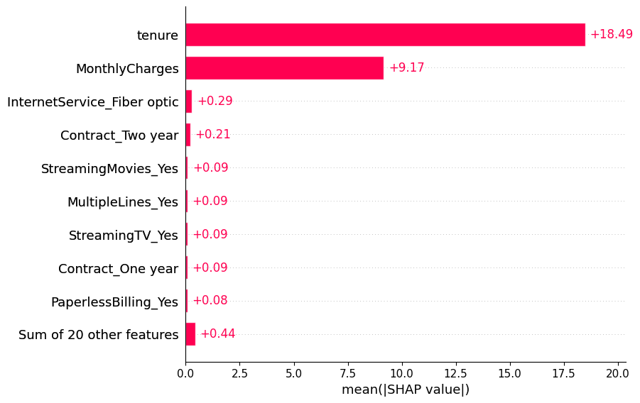
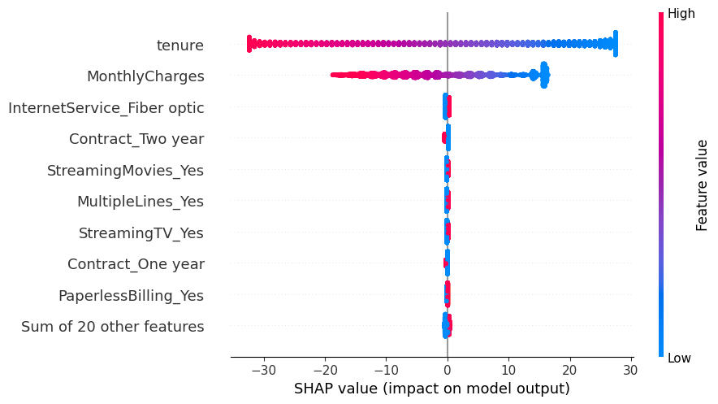

# Telco Customer Churn Analysis

End-to-end machine learning project using the IBM Telco Customer Churn dataset to predict customer churn, compare classification models, identify key churn drivers, and segment customers through clustering and feature importance analysis.
---

## Objectives

- Predict customer churn using supervised learning models
- Compare multiple classification approaches under consistent evaluation
- Identify key drivers of churn using permutation feature importance
- Segment customers using unsupervised clustering (K-Means + PCA visualization)
- Evaluate models using:
  - Accuracy
  - Precision
  - Recall
  - F1 Score
  - ROC-AUC

---

## Dataset

IBM Telco Customer Churn Dataset  
https://www.kaggle.com/datasets/blastchar/telco-customer-churn

- ~7,000 customer records
- Mix of categorical and numerical features
- Binary target: churn (Yes/No)

---

## Modeling Approaches

- Logistic Regression (scaled pipeline baseline)
- Random Forest
- XGBoost

---

## Methodology

### Data Preprocessing
- Handled missing values in `TotalCharges`
- One-hot encoded categorical variables
- Converted target variable to binary format
- Removed customer ID from feature space

### Feature Engineering
- Standard scaling for distance-based methods
- PCA for 2D clustering visualization (not used for supervised learning)

### Unsupervised Learning
- K-Means clustering on PCA-reduced feature space
- Elbow method + silhouette score used to select cluster count
- Cluster profiling based on churn rate, tenure, and revenue

### Supervised Learning
- Stratified 5-fold cross-validation
- Pipeline-based model training (scaling included where needed)
- Evaluation using ROC-AUC, F1, precision, and recall

### Model Interpretability
- Permutation feature importance for global explanations
- Cluster-level behavioral analysis for segmentation insights

---

## Results

| Model | Accuracy | Precision | Recall | F1 Score | ROC-AUC | AP Score |
|---------|---------:|---------:|---------:|---------:|---------:|---------:|
| Logistic Regression | 0.804 | 0.658 | 0.547 | 0.597 | **0.844** | **0.653** |
| Random Forest | 0.797 | 0.691 | 0.426 | 0.527 | 0.842 | 0.652 |
| XGBoost | 0.795 | 0.676 | 0.442 | 0.534 | 0.837 | 0.650 |

*Metrics reported using stratified 5-fold cross-validation. ROC-AUC standard deviation ranged from 0.009–0.010 across models, indicating stable performance across folds.*

Logistic Regression delivered the strongest overall performance while maintaining full model interpretability, making it the preferred model for this dataset.

---

## Key Findings

- Logistic Regression achieved the highest ROC-AUC (0.844) and Average Precision Score (0.653) among all tested models while remaining the most interpretable. 
- Random Forest achieved the highest precision (0.691), but at the expense of substantially lower recall, highlighting the trade-off between identifying churners and minimizing false positives. 
- More complex ensemble methods (Random Forest and XGBoost) provided limited performance improvement over Logistic Regression, suggesting the underlying churn relationships are largely captured by a linear decision boundary. 
- Customer churn was strongly associated with contract structure, internet service type, and customer lifecycle indicators. 
- Customer segmentation identified distinct groups with materially different churn rates, tenure profiles, and revenue contribution. 
- ROC-AUC standard deviation remained below 0.01 across all models, indicating stable performance across cross-validation folds.

---

## Visualizations

### Cluster Selection

### PCA Cluster Visualization

### Model Performance

### Explainability

---

## Future Work

- Hyperparameter tuning (especially XGBoost depth/regularization)
- Stability testing of clustering assignments
- Feature interaction analysis (beyond permutation importance)

---

## Tools & Libraries

- Python (Pandas, NumPy)
- Scikit-learn
- XGBoost
- Plotly / Matplotlib
- KaggleHub
- Shap

---

## Notes

- PCA was used only for visualization, not for model training
- Clustering is exploratory and used for segmentation insight, not as a predictive feature